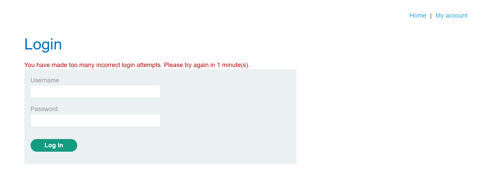

# Brute-force Protection Bypass — IP Block

*Lab: [Broken brute-force protection, IP block](https://portswigger.net/web-security/authentication/password-based/lab-broken-bruteforce-protection-ip-block) — PortSwigger Web Security Academy*

## Credentials

- My account: `wiener:peter`
- Victim: `carlos`
- Password list: provided by the lab

## Investigation

- I started brute-forcing `carlos`.
- After too many incorrect login attempts, my IP got blocked for 1 minute.
- After 1 minute, the block disappears and I can make more attempts again.



I was already using:

```
X-Forwarded-For: <IP>
```

*(I cover what this header does and why it can bypass IP-based protections in more detail in my [previous writeup on username enumeration via response timing](../Username-Enum-via-Response-Timing/Breakdown.md).)*

Since the block was temporary, I first thought: what if I just wait for 1 minute every time I get blocked and then continue?

```
brute-force
    ↓
IP blocked
    ↓
sleep 60 seconds
    ↓
continue
    ↓
IP blocked
    ↓
repeat
```

But this wasn't the actual way to bypass the protection.

### Looking at the logic

I started paying attention to when the counter gets reset. I noticed that I could make 2 failed attempts against `carlos`, then successfully log in with my own account:

```
carlos + wrong password
carlos + wrong password
        ↓
wiener:peter
```

The Logic Flow Breakdown: logging in successfully as `wiener` resets the failed-attempt counter. So instead of trying to avoid the IP block, I can prevent the counter from reaching it. The flow becomes:

```
carlos + password
carlos + password
        ↓
wiener:peter
        ↓
counter reset
        ↓
carlos + password
carlos + password
        ↓
wiener:peter
        ↓
counter reset
        ↓
...
```

This lets me continue testing passwords against `carlos` without reaching the threshold that triggers the protection.

## Conclusion

A logic flaw is not always about breaking a security check directly. Sometimes, every individual check works correctly, but the order and interaction between different actions creates a way to bypass the intended protection.

When testing an application, always think about the logic flow: what happens before, what happens after, what gets reset, and what changes when I perform an action in an unexpected order.


