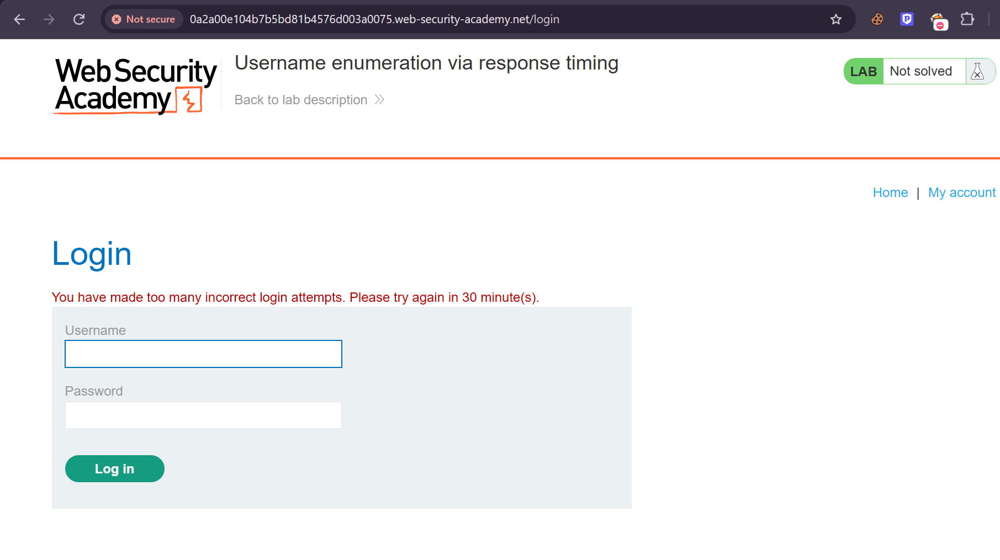

## Lab

**Username enumeration via response timing**

## Objective

The goal of this lab was to identify a valid username by analyzing differences in response times, then brute-force the password using the provided password list.

The lab also implements IP-based brute-force protection, which makes repeated requests from the same IP get blocked.

---

## 1. Starting the username enumeration

I started by trying to enumerate the username.

I kept the password fixed and sent login requests using the provided list of usernames.

The idea was to compare the responses and look for a username that produced a different response time from the others.

At first, I was able to send multiple requests, but after several attempts, my IP address was blocked.

>  IP blocked after multiple brute-force attempts

---

## 2. Bypassing the IP-based protection

Since the IP block prevented me from continuing the enumeration, I investigated how the application was determining the client's IP address.

I searched for ways to bypass IP-based brute-force protection and came across the `X-Forwarded-For` HTTP header.

### `X-Forwarded-For`

`X-Forwarded-For` is an HTTP header commonly used by proxies to indicate the original client's IP address.

The important point in this lab is that the application was incorrectly trusting a **client-controlled header**.

I tested adding:

```http
X-Forwarded-For: 1.1.1.1
```

to my requests.

I then changed the value between requests, for example:

```http
X-Forwarded-For: 1.1.1.1
X-Forwarded-For: 1.1.1.2
X-Forwarded-For: 1.1.1.3
```

This allowed me to bypass the IP-based protection because the application treated the value supplied in the header as the client's IP.

### The important security issue

The problem was not that `X-Forwarded-For` magically changed my real IP.

My actual network IP remained the same.

The problem was that the application trusted an IP address supplied by the client when applying its brute-force protection.

```text
Attacker
   |
   | Real IP = attacker IP
   |
   | X-Forwarded-For: 1.1.1.1
   v
Application
   |
   | Uses X-Forwarded-For
   v
Brute-force protection
   |
   | IP = 1.1.1.1
```

By changing the header, I could make the application associate requests with different IP addresses.

---

## 3. Continuing the username enumeration

After bypassing the IP restriction, I continued enumerating the usernames.

I kept the password fixed and tested the usernames from the provided list.

I compared the response times for the different requests.

After identifying a username that consistently produced a longer response time, I verified it multiple times to make sure the difference was not just network variation.

This gave me the valid username.

---

## 4. Why does the response time reveal the username?

The important behavior was what happened after the username was found.

When the username is invalid, the application can reject the login without performing the full password-checking process.

When the username is valid, the server proceeds to check the supplied password.

The password-checking process takes time, and the time can depend on the password input.

Therefore, a valid username can produce a measurable difference in response time.

Conceptually:

```text
Invalid username
       |
       v
Username not found
       |
       v
Fast response


Valid username
       |
       v
Password verification
       |
       v
Longer response
```

By comparing response times across many usernames, the valid username can therefore be identified.

---

## 5. Brute-forcing the password

Once I had the valid username, the remaining step was straightforward.

I fixed the username and used the provided password list to brute-force the password.

The correct username allowed the application to reach the password verification stage, making the timing difference useful for the enumeration phase.

Eventually, the correct password was found and the lab was solved.

---

## Final attack flow

```text
Username list
     |
     v
Enumerate usernames
     |
     v
IP blocked
     |
     v
Add X-Forwarded-For
     |
     v
Bypass IP-based protection
     |
     v
Continue username enumeration
     |
     v
Compare response times
     |
     v
Identify valid username
     |
     v
Brute-force password
     |
     v
Lab solved
```

## Key takeaways

* Response timing can sometimes be used to enumerate valid usernames.
* Authentication mechanisms can leak information through timing differences.
* IP-based brute-force protection can be ineffective if it relies on attacker-controlled headers.
* `X-Forwarded-For` should not blindly be trusted when making security-sensitive decisions.
* Small differences in HTTP responses can reveal important information when measured consistently.
* Always verify a timing-based finding multiple times to reduce the possibility of network noise causing a false positive.
